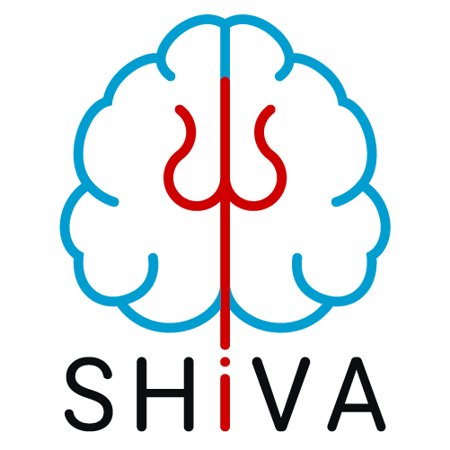
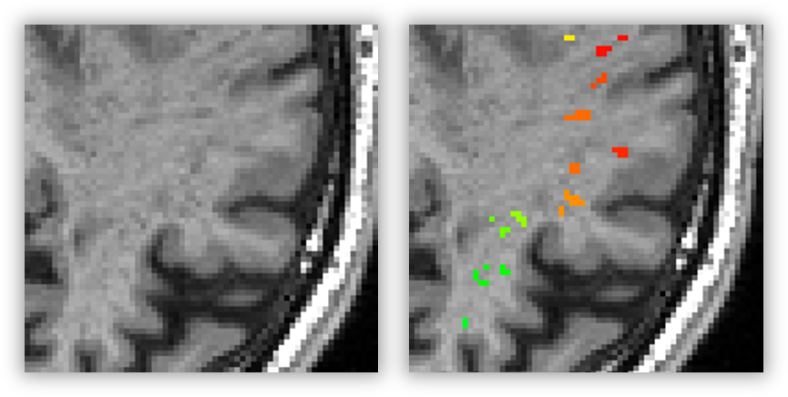
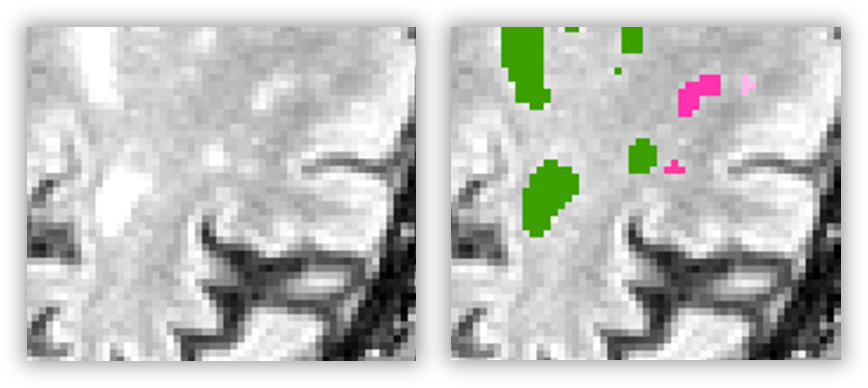
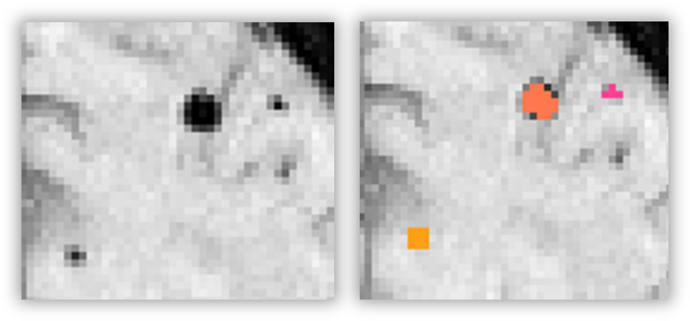
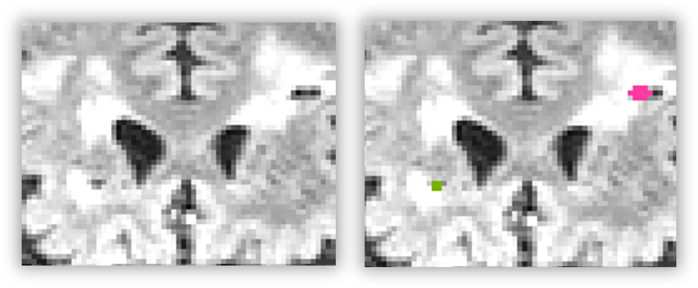

# SHiVAi: SHiVA preprocessing and deep learning segmentation workflow


The shivai package includes a set of image analysis tools for the study of covert cerebral small vessel diseases (cCSVD) with structural Magnetic Resonance Imaging. More specifically, it installs **SHiVAi**, the full pipeline for preprocessing, AI-based segmentation, and reporting of cCVSD biomarkers.

The SHiVAi segmentation tools currently include Cerebral MicroBleeds (CMB),  PeriVascular Spaces (PVS) (also known as Virchow Robin Spaces - VRS), White Matter Hyperintensities (WMH), and Lacunas. The 3D-Unet model weights are available separately at https://github.com/pboutinaud.

The tools cover preprocessing (image resampling and cropping to match the required size for the deep learning models, coregistration for multimodal segmentation tools), automatic segmentation, and reporting (QC and results). It accepts both Nifti and DICOM images as input (see the possible [input structures](#data-structures-accepted-by-shivai) for more details).

<br clear="right"/>

**cCSVD biomarkers detected with SHiVAi**


## Intellectual property & Licencing

All the content, code, and ressources of this repository, has been registered at the french 'Association de Protection des Programmes' under the number:  [IDDN.FR.001.410014.000.S.P.2024.000.21000](https://secure2.iddn.org/app.server/certificate/?sn=2024410014000&key=25dae5f5f3fc7b77d5018285173dc2b184d9358e091bbd1fe3e0be955306d7ee&lang=fr)

The Shivai pipeline and all the repository content is provided under the GNU Affero General Public License version 3 (Affero GPLv3) or more recent.


## Index

- [Dependencies and hardware requirements](#dependencies-and-hardware-requirements)
- [Package Installation](#package-installation)
    - [Trained AI model](#trained-AI-model)
    - [Brain masking](#brain-masking)
    - [Fully contained process](#fully-contained-process)
    - [Traditional python install](#traditional-python-install)
    - [Mixed approach (recommended)](#mixed-approach-recommended)
- [Running the process](#running-the-process)
    - [Segmentation choice](#segmentation-choice)
    - [Running SHiVAi from an Apptainer container](#running-shivai-from-an-apptainer-container)
    - [Running SHiVAi from an Docker container](#running-shivai-from-an-docker-container)
    - [Running SHIVAI from direct package commands (recommended)](#running-shivai-from-direct-package-commands-recommended)
- [Results](#results)
- [Data structures accepted by SHiVAi](#data-structures-accepted-by-shivai)
- [Additional info](#additional-info)
    - [Create missing json file](#create-missing-json-file)
    - [More info on the .yml configuration file](#more-info-on-the-yml-configuration-file)

## Dependencies and hardware requirements

The SHiVAi application requires a Linux machine with a GPU (with 16GB of dedicated memory).

The deep-learning models relies on Tensorflow 2.7.13. The processing pipelines are implemented with Nipype and make use of ANTs (Copyright 2009-2023, ConsortiumOfANTS) for image registration and [Quickshear](https://github.com/nipy/quickshear) (Copyright 2011, Nakeisha Schimke) for defacing. Quality control reporting uses (among others) DOG contours [PyDog](https://github.com/neurolabusc/PyDog) (Copyright 2021, Chris Rorden). Building and/or using the container image relies on Apptainer (https://apptainer.org). More details about Apptainer in the [Apptainer image](#apptainer-image) section and our [Appatainer readme file](apptainer/README.md).

## Package Installation

Depending on your situation you may want to deploy SHiVAi in different ways:
- **Fully contained process**: The simplest approach. All the computation is done through the Apptainer image. It accounts for most of the local environment set-up, which simplifies the installation and ensure portability. However the process in run linearly (no parallelization of the different steps).
- **Traditional python install**: does not require apptainer as all the dependencies will have to be installed locally. Useful for full control and development of the package, however it may lead to problems due to the finicky nature of TensorFlow and CUDA.
- **Mixed approach**: Local installation of the package without TensorFlow (and so without troubles), but using the Apptainer image to run the deep-learning processes (using TensorFlow). Ideal for parallelization of the processes and use on HPC clusters.

### Trained AI model

In all the mentioned situations, **you will also need** to obtain the trained deep-learning models you want to use (for PVS, WMH, CMB, and Lacuna segmentation).
They are available at [https://github.com/pboutinaud](https://github.com/pboutinaud)

All the models must be stored in a common folder whose path must also be filled in the `model_path` variable of the config file (see point 4 of [Fully contained process](#fully-contained-process)).
Let's consider that you stored them in `/myHome/myProject/Shiva_AI_models` for the following parts.

Each model must also be paired with a `model_info.json` file. These json files should be available on the same repository as their corresponding model.
Note that json these files are where the pipeline will look for the models path, so you may have to manually edit the path to the models. By default, the paths to the models are the relative path starting from the folder storing the specific model it is paired with (e.g. `brainmask/modelfile.h5` for the brain mask models used [below](#brain-masking), stored in a `brainmask` folder).

This way, if you simply extract the downloaded models in the common model folder, the `model_info.json` file *should* already be good (e.g., the brainmask model should end up with a full path like `/myHome/myProject/Shiva_AI_models/brainmask/modelfile.h5`).

Once you have your models and json files properly stored and setup, update the config file with the correct path for each "descriptor" file (i.e. the json files).

> ⚠️If the `model_info.json` is not available for some reason, refer to the [Create missing json file](#create-missing-json-file) section, and don't forget to update the config file  if you use one.

### Brain masking

SHiVAi relies on the access to brain masks in order to crop the input volumes to the proper dimension for the aI models. More details are available [below](#brain-parcellation-and-region-wise-statistics), but if you do not have such masks on hand, SHiVAi can create them automatically using a dedicated AI model. To use this option, you will have to download it and store (after extracting/unzipping) in the same folder as the other AI models. The brain masking model can be found following the link: [https://cloud.efixia.com/sharing/Mn9LB5mIR](https://cloud.efixia.com/sharing/Mn9LB5mIR)

### Fully contained process

1. You will need to have **Apptainer** installed (previously known as **Singularity**):
https://apptainer.org/docs/user/main/quick_start.html

2. Download the Apptainer image (.sif file) from [https://cloud.efixia.com/sharing/HKbnJ44zG](https://cloud.efixia.com/sharing/HKbnJ44zG) (it may take a while, the image weighs about 4GB).
    Let's assume you saved it in `/myHome/myProject/shiva.sif`

3. From the shivai repository (where you are reading this), navigate to the [apptainer folder](apptainer/) and download [run_shiva.py](apptainer/run_shiva.py) and [config_example.yml](apptainer/config_example.yml)

4. You now need to prepare this `config_example.yml`, it will hold diverse parameters as well as the path to the AI model and to the apptainer image. There, you should change the placeholder paths for `model_path` and `apptainer_image` with your own paths (e.g. `/myHome/myProject/Shiva_AI_models` and `/myHome/myProject/shiva.sif`). You will also have to set the model descriptors (like `PVS_descriptor` or `WMH_descriptor`) with the path to the `model_info_*.json` file [mentioned above](#trained-ai-model).

> Other than the "descriptor" paths, you shouldn't have to modify any other setting in the `parameters` part.

For the rest of this readme, let's assume that you now have the config file prepared and saved as `/myHome/myProject/myConfig.yml`.

5. Finally, set-up a minimal Python virtual environment with the `pyyaml` package installed.

Next, see [Running a contained SHiVAi](#running-shivai-from-a-container)

### Traditional python install

This type of install is mostly aimed for development and require some know-how to find the proper Drivers for GPU usage. For a simpler install, see [the Mixed approach section](#mixed-approach-recommended).

To deploy the python package, create a Python 3.9 virtual environment, clone or download the shivai project and use the following command line from the project's directory (containing the 'pyproject.toml' file): 

```bash
python -m pip install .[TF_CUDA]
```

If you already have CUDA installed on your machine (CUDA 11.8 for Tensofrflow 2.13), with the proper environment variable set-up (such as CUDA_HOME), you can install the package without the CUDA install:

```bash
python -m pip install .[TF]
```

You will also need a few software locally installed:

1. The ANTs toolbox (which can be downloaded from [the original repository](http://stnava.github.io/ANTs/) or conveniently installed with `conda` if you use it using the `conda install -c aramislab ants` command line)

2. Graphviz, either with [a classic install](https://graphviz.org/download/) or with `conda` if you are using Anaconda: `conda install graphviz`

3. [dcm2niix](https://github.com/rordenlab/dcm2niix), which has several methods of installations (as per the readme on the linked Github page), among which is a convenient `conda` install: `conda install -c conda-forge dcm2niix`

4. [niimath](https://github.com/rordenlab/niimath) (optional, used for some backward compatibility).

5. And, optionally, [SynthSeg](https://surfer.nmr.mgh.harvard.edu/fswiki/SynthSeg) (available as part of recent versions of [FreeSurfer](https://surfer.nmr.mgh.harvard.edu/fswiki/DownloadAndInstall) or directly from [their GitHub page](https://github.com/BBillot/SynthSeg)). Synthseg is used to provide individual brain parcellations which is used to compute region-wise statistics for each biomarkers. For more info, see the [Brain parcellation and region-wise statistics](#brain-parcellation-and-region-wise-statistics) section.

The scripts should then be available from the command line prompt.

Optionally, you can download and prepare the `config_example.yml` like explained in the [Fully contained process](#fully-contained-process) section. This will ease the command call as a lot of arguments will be given through the yaml file (instead of manually entered with the command).

Next, see [Running SHiVAi from direct package commands](#running-shivai-from-direct-package-commands)

### Mixed approach (recommended)

For this approach, you will need to both install the shivai package and download the Apptainer image. First, like in [Traditional python install](#traditional-python-install), create a dedicated Python 3.9 environment, clone or download shivai, and, from the project's directory (and within the new virtual environment), run:

```bash
python -m pip install .
```

Then, download the Apptainer image and prepare the configuration file as explained in [Fully contained process](#fully-contained-process) (you can ignore the point 3 as you won't need the `run_shiva.py` script).

To run SHiVAi with this approach, see point **2** in [Running SHiVAi from direct package commands (recommended)](#running-shivai-from-direct-package-commands-recommended)

## Running the process

### Biomarker segmentation choice

In all cases below, you will be prompted to chose a "prediction". This refers to the type of segmentation you want to compute, and it will depend on your available MRI acquisitions:
- PVS: Mono-modal segmentation of perivascular spaces -> Uses T1 acquisitions
- PVS2: Bi-modal segmentation of perivascular spaces -> Uses both T1 and FLAIR acquisitions
- WMH: Bi-modal segmentation of white matter hyperintensities -> Uses both T1 and FLAIR acquisitions
- CMB: Mono-modal segmentation of cerebral microbleeds -> Uses SWI acquisitions
- LAC: Bi-modal segmentation of lacunas -> Uses both T1 and FLAIR acquisitions
- all: PVS2 + WMH + CMB -> Uses T1, FLAIR, and SWI acquisitions

Examples of segmentations, detected biomarkers overlaid on original image:
- PVS (overlaid on the T1w acquisition)



- WMH (overlaid on the FLAIR acquisition)



- CMB (overlaid on the SWI acquisition)



- Lacunas (overlaid on the FLAIR acquisition)



### Brain parcellation and region-wise statistics

The SHiVAi pipeline relies on the extraction of the brain, at minima to crop the volume to the proper dimensions, and offers the possibility to count cCSVD biomarkers by brain region if a brain parcellation is available. These options are set with the `brain_seg` argument of the shiva command lines (as is presented below). This argument can be set to `shiva`, `premasked`, `synthseg`, or `custom`.

By default, SHiVAi uses `shiva`, which computes a brain mask using an AI model. Using `premasked` tells the pipeline that the input images are already brain-extracted, and using `custom` (without specifying a lookup-table with the `custom_LUT` argument) tells the pipeline to look for a brain mask among the input data (see [Data structures accepted by SHiVAi](#data-structures-accepted-by-shivai) for more details). In these three cases, the biomarker metrics are computed over the whole brain.

However, SHiVAi also accepts brain parcellations and will then associate each biomarker with a region and provide more details about their distribution across the brain.
To do this we recommend using the `synthseg` argument (see next paragraph). This can be achieved with the `custom` argument by filling the `custom_LUT` argument with the path to a look-up table stored in a file (see the accepted format in the command line help).

In our implementation, we mainly worked with the [Synthseg parcellation](https://surfer.nmr.mgh.harvard.edu/fswiki/SynthSeg) to generate custom parcellation for each type of biomarker (hemispheres are always differenciated in the labels):
- For PVS, we distinguish the basal ganglia territory, the cerebral white matter (away from the BG), the hippocampus, the cerebellum, the ventral diencephalon, the brainstem.
- For WMH, we segregate biomarkers between shallow, deep, periventricular, and cerebellar white matter, as well as the brain stem.
- For CMB and Lacuna, we used the [The Microbleed Anatomical Rating Scale (MARS)](https://doi.org/10.1212/wnl.0b013e3181c34a7d).

Synthseg is a project completly independent from Shiva and it was used here as a very convenient and powerful tool. As such, we do not directly provide the Synthseg software. However, it can be installed through the steps mentioned in [Traditional python install](#traditional-python-install) or, if you are using Apptainer to run SHiVAi (with the "Fully contained process" or the "mixed approach"), we provide a [recipe](apptainer/apptainer_synthseg_tf.recipe) to build an Apptainer image that will contain Synthseg and is designed to properly interface with SHiVAi. More details can be found in the [corresponding section of our Apptainer readme](apptainer/README.md#synthseg-apptainer-image). 

### Running SHiVAi from an Apptainer container

When running SHiVAi from an Apptainer image, you can do it linearly (no parallelisation of the steps, default behavior), or in parallel using the Python multiprocessing library, [as implemented by Nypipe](https://nipype.readthedocs.io/en/0.11.0/users/plugins.html#multiproc). However, we have seen problems with the multiprocessing option on some systems, so it may not work.

To run the shiva process, you will need:
- The [run_shiva.py](apptainer/run_shiva.py) scirpt
- The input dataset (see [Data structures accepted by SHiVAi](#data-structures-accepted-by-shivai))
- The Apptainer image (`shiva.sif`)
- The trained AI model (that we provide and you should have downloaded)
- A configuration file (.yml) that will contain all the options and various paths needed for the workflow

**Command line arguments (with `run_shiva.py`):**

    --in: Path of the input dataset\
    --out: Path to where the generated files will be saved\
    --input_type: Type of structure file, way to capture and manage nifti files : standard or BIDS\
    --prediction: Choice of the type of prediction (i.e. segmentation) you want to compute (PVS, PVS2, WMH, CMB, all). Give a combination of these labels separated by blanc spaces.\
    --brain_seg: Type of brain segmentation (or parcellation) to use in the pipeline (shiva, premasked, synthseg, or custom)\
    --config: File with configuration options for the workflow

These are the most useful argument you will want to set. However, there are more arguments available to further control the pipeline. To see them and their description, run `python run_shiva.py --help`.

**Command line example**

Running the processing (from the directory where you stored `run_shiva.py`): 

```bash
python run_shiva.py --in /myHome/myProject/MyDataset --out /myHome/myProject/shiva_results --input_type standard --prediction PVS CMB --brain_seg synthseg --config /myHome/myProject/myConfig.yml
```
> If you have installed the shivai package locally, you can replace `python run_shiva.py` by `shiva_contained` in the command line.

### Running SHiVAi from an Docker container

As we mostly worked on a seemless Apptainer integration, running Shivai with a Docker container will require a little more work from the user, especially concerning the mounting of host volumes to the container.

Required mounts:
- Input data folder (that you would have given to --in)
- Output folder (that you would have given to --out)
- Folder containing the config file (given to --config)
- Folder containg the models (that is normally given in the config file at the `model_path` keyword). This one must me **specifically mounted** to `/mnt/model`

To build (and run) the docker image, you need root priviledges. Go to the folder containing the Dockerfil (the root folder of the project) and run:
```
docker build --rm -t myId/shivai .
```

To run the image, here is an example:
```
docker run --gpus all --rm --name shivai --volume /my_home/my_data/MRI_anat:/mnt/input_data:ro --volume /my_home/my_project/test_docker:/mnt/out --volume /scratch/nozais/test_shiva/modele_pred/ReferenceModels_K3:/mnt/model:ro --volume /scratch/nozais/test_shiva:/mnt/config_dir myId/shivai shiva --containerized_all --in /mnt/input_data --out /mnt/out --config /mnt/config_dir/config_debug.yml --prediction PVS
```
Change the local paths (like `/my_home/my_data/MRI_anat` to your own), change the `shiva` arguments if needed (e.g. the prediction), and run it.

> For now, this does not run with the Synthseg parcelation scheme. Stay tuned for more info on that soon.

### Running SHiVAi from direct package commands (recommended)

From the virtual environment where you installed shivai, run the command `shiva` (calling the `shiva.py` script).

To see the detailed help for this command, you can call:
```bash
shiva -h
```

Here is an example of a shiva call, using a config .yml file, processing linearly on available GPUs:
```bash
shiva --in /myHome/myProject/MyDataset --out /myHome/myProject/shiva_results --input_type standard --prediction PVS CMB --brain_seg synthseg --config /myHome/myProject/myConfig.yml
```

Using SLURM to parallelize the processes (use `--run_plugin SLURM` in the arguments):
1. Without Apptainer image (requires TensorFlow, CUDA, ANTs and niimath locally installed):
    ```bash
    shiva --in /myHome/myProject/MyDataset --out /myHome/myProject/shiva_results --input_type standard --prediction PVS CMB --config /myHome/myProject/myConfig.yml --run_plugin SLURM
    ```
    Here, the configuration file (`/myHome/myProject/myConfig.yml`) is optional, but helps with the readability of the command line

2. With the Apptainer image used on the nodes requiring TensorFlow, CUDA, ANTs or niimath (use `--containerized_nodes` in the arguments):
    ```bash
    shiva --in /myHome/myProject/MyDataset --out /myHome/myProject/shiva_results --input_type standard --prediction PVS CMB --config /myHome/myProject/myConfig.yml --run_plugin SLURM --containerized_nodes
    ```
    Here, the configuration file (`/myHome/myProject/myConfig.yml`) is absolutly necessary as it holds the path to the Apptainer image.

## Results

The results will be stored in the `results` folder in your output folder (so `/myHome/myProject/shiva_results/results` in our example). There you will find the results for individual participants as well as a results_summary folder that contains grouped data like statistics about each subjects segmentation and quality control (QC).

You will also find a PDF report for each participant detailing statics about their segmentation and QC in `results/report/{participant_ID}/Shiva_report.pdf`

**Example of results folder**

    results
    ├── results_summary
    │   ├── wf_graph
    │   │   └── graph.svg (graph representation of the pipeline)
    │   │
    │   ├── segmentations
    │   │   ├── pvs_metrics
    │   │   │   └── prediction_metrics.csv (segmentation metrics for all the participants)
    │   │   ├── cmb_metrics_swi-space
    │   │   :
    │   │
    │   └── preproc_qc (some QC metrics to run at the group level to check)
    │       ├── qc_metrics.csv (QC metrics to compare between each participants)
    │       ├── qc_metrics_plot.svg (image to find problematic participants at a glance)
    │       └── failed_qc.json (list of participants that failed QCs)
    │
    ├── shiva_preproc
    │   ├── t1_preproc
    │   │   ├── sub-001
    │   │   │   ├── sub-001_T1_defaced_cropped_intensity_normed.nii.gz (T1 image after preprocessing)
    │   │   │   ├── brainmask_cropped.nii.gz (brain mask in the same space as preprocessed images)
    │   │   │   └── cdg_ijk.txt / bbox1.txt / bbox2.txt (coordinates used for the cropping)
    │   │   │
    │   │   ├── sub-002
    │   │   :
    │   │
    │   ├── swi_preproc
    │   │   ├── sub-001
    │   │   │   ├── (equivalent ouputs than for t1_preproc, but in SWI space)
    │   │   │   ├── swi_to_t1__Warped.nii.gz (SWI image registered on the T1)
    │   │   │   └── swi_to_t1__0GenericAffine.mat (transformation affine for SWI the registration)
    │   │   │
    │   │   ├── sub-002
    │   │   :
    │   │
    │   ├── synthseg
    │   │   ├── sub-001
    │   │   │   ├── cleaned_synthseg_parc.nii.gz (synthseg brain parcellation after cleaning step)
    │   │   │   ├── removed_clusters_synthseg_parc.nii.gz (correction from the cleaning step)
    │   │   │   ├── derived_parc.nii.gz (lobar parcellation derived from synthseg for WM and GM)
    │   │   │   └── brainmask_cropped.nii.gz (brainmask derived from synthseg parc)
    │   │   │
    │   │   ├── sub-002
    │   │   :
    │   │
    │   └── qc_metrics
    │       ├── sub-001
    │       │   └── qc_metrics.csv (individual metrics used in results_summary/preproc_qc)
    │       │
    │       ├── sub-002
    │       :
    │   
    ├── segmentation
    │   ├── pvs_segmentation
    │   │   ├── sub-001
    │   │   │   ├── pvs_map.nii.gz (raw segmentation ouput by the model)
    │   │   │   ├── labelled_pvs.nii.gz (labeled clusters detected in the segmentation map)
    │   │   │   ├── pvs_census.csv (list of all clusters, their label, size, and brain region)
    │   │   │   ├── pvs_stats.csv (statistics computed on the census, like number or mean size)
    │   │   │   ├── Brain_Seg_for_PVS.nii.gz (brain parcellation derived from synthseg for PVS)
    │   │   │   └── pvs_region_dict.json (lookup-table for the brain parcellation)
    │   │   │
    │   │   ├── sub-002
    │   │   :
    │   ├── cmb_segmentation_swi-space
    │   :
    │
    └── report
        ├── sub-001
        │   └── Shiva_report.pdf
        │
        ├── sub-002
        :


## Data structures accepted by SHiVAi
The pipeline can accept two types of structure for **Nifti** input: *BIDS* and "*standard*".

It is also possible to give images stored as **DICOM** (using the `--file_type dicom` option in the command line), but this in only compatible with the *standard* input structure

Example of `BIDS` structure folders:

    .
    ├── dataset_description.json
    └── rawdata
        ├── sub-21
        │   └── anat
        │       ├── sub-21_FLAIR_raw.nii.gz
        │       ├── sub-21_T1_raw.nii.gz
        │       └── sub-21_seg.nii.gz
        ├── sub-51
        │   └── anat
        │       ├── sub-51_FLAIR_raw.nii.gz
        │       ├── sub-51_T1_raw.nii.gz
        ·       └── sub-21_seg.nii.gz


Example of `standard` structure folders (the important parts are the name of the subject folder, e.g. "sub-21", and the name of the sub folders, e.g. "flair" or "t1", with only one nifti file per folder):

    .
    ├── sub-21
    │   ├── flair
    │   │   └── sub-21_FLAIR_raw.nii.gz
    │   ├── t1
    │   │   └── sub-21_T1_raw.nii.gz
    │   └── seg
    │       └── sub-21_brainparc.nii.gz
    ├── sub-51
    │   ├── flair
    │   │   └── sub-51_FLAIR_raw.nii.gz
    │   ├── t1
    │   │   └── sub-51_T1_raw.nii.gz
    │   └── seg
    ·       └── sub-51_brainparc.nii.gz

In the case of DICOM files (the individual names of each files do not matter here):

    .
    ├── sub-21
    │   ├── flair
    │   │   ├── xxxxx.dcm
    │   │   ├── xxxxx.dcm
    │   │   ├── xxxxx.dcm
    │   │   :
    │   │
    │   └── t1
    │       ├── xxxxx.dcm
    │       ├── xxxxx.dcm
    │       ├── xxxxx.dcm
    :       :


<!-- 
Example of `json` structure input:
```json
{
    "parameters": {
        "out_dir": "/mnt/data/output",
        "brainmask_descriptor": "/myHome/myProject/Shiva_AI_models/model_info/brainmask/model_info.json",
        "WMH_descriptor": "/myHome/myProject/Shiva_AI_models/model_info/T1.FLAIR-WMH/model_info.json",
        "PVS_descriptor": "/myHome/myProject/Shiva_AI_models/model_info/T1.FLAIR-PVS/model_info.json",
        "percentile": 99.0,
        "final_dimensions": [
            160,
            214,
            176
        ],
        "voxels_size": [
            1.0,
            1.0,
            1.0
        ]
    },
    "files_dir": "/myHome/myProject/MyDataset",
    "all_files": {
        "21": {
            "t1": "21_T1_raw.nii.gz",
            "flair": "21_FLAIR_raw.nii.gz"
        },
        "51": {
            "t1":"51_T1_raw.nii.gz",
            "flair": "51_FLAIR_raw.nii.gz"
        }
    }
}
``` -->

## Additional info

### Create missing json file

In some cases, the model_info.json might be missing from the model folder you downloaded. To create it, you need to use the `prep_json.py` script, found in src/shivai/scripts/prep_json.py.

Let's assume you downloaded the T1-PVS model (for PVS detection using only T1 images), you should now have it in `/myHome/myProject/Shiva_AI_models/T1-PVS` (or something close to this).

If you directly download `prep_json.py` it, you can run it with:
```bash
python shiva_prep_json.py --folder /myHome/myProject/Shiva_AI_models/T1-PVS
```

If you installed the shivai package, you can directly run the command line:
```bash
shiva_prep_json --folder /myHome/myProject/Shiva_AI_models/T1-PVS
```

### More info on the .yml configuration file

- **model_path** (path) : bind mount path for the tensorflow models directory
- **apptainer_image** (path): path to apptainer container file for SHiVAi
- **synthseg_image** (path): path to apptainer container file for SynthSeg (optional)
- **brainmask_descriptor** (path): path to brain_mask tensorflow model descriptor
- **PVS_descriptor** (path): path of Peri-Vascular Spaces tensorflow model descriptor
- **PVS2_descriptor**  (path): path of Peri-Vascular Spaces tensorflow model descriptor using t1 and flair together
- **WMH_descriptor** (path): path of White Matter HyperIntensities tensorflow model descriptor
- **CMB_descriptor** (path): path of Cerebral MicroBleeds tensorflow model descriptor
- **LAC_descriptor** (path): path of Lacuna tensorflow model descriptor
- **swi_echo** (int): Echo number used in SWI volumes extracted from DICOM files, 0 (first echo) or 1 (second echo)
- **percentile** (float) : Threshold value for the intensity normalization, expressed as percentile
- **threshold** (float) : Value of the threshold used to binarize brain masks
- **threshold_pvs** (float) : Threshold to binarize PVS clusters after the segmentation
- **threshold_wmh** (float) : Threshold to binarize WMH clusters after the segmentation
- **threshold_cmb** (float) : Threshold to binarize CMB clusters after the segmentation
- **threshold_lac** (float) : Threshold to binarize Lacuna clusters after the segmentation
- **min_pvs_size** (int): Filter size (in voxels) for detected PVS under which the cluster is discarded
- **min_wmh_size** (int): Filter size (in voxels) for detected WMH under which the cluster is discarded
- **min_cmb_size** (int): Filter size (in voxels) for detected CMB under which the cluster is discarded
- **min_lac_size** (int): Filter size (in voxels) for detected Lacuna under which the cluster is discarded
- **final_dimensions** (list) : Image array size in i, j, k input to the model. Should be [160, 214, 176].
- **voxels_size** (list) : Voxel size used for the resampling before entering the model
- **interpolation** (str): image resampling method, default interpolation : 'WelchWindowedSinc', others ANTS interpolation possibilities : 'Linear', 'NearestNeighbor', 'CosineWindowedSinc', 'HammingWindowedSinc', 'LanczosWindowedSinc', 'BSpline', 'MultiLabel', 'Gaussian', 'GenericLabel'


## Acknowledgements
This work has been done in collaboration between the [Fealinx](http://www.fealinx-biomedical.com/en/) company and the [GIN](https://www.gin.cnrs.fr/en/) laboratory (Groupe d'Imagerie Neurofonctionelle, UMR5293, IMN, Univ. Bordeaux, CEA , CNRS) with grants from the Agence Nationale de la Recherche (ANR) with the projects [GinesisLab](http://www.ginesislab.fr/) (ANR 16-LCV2-0006-01) and [SHIVA](https://rhu-shiva.com/en/) (ANR-18-RHUS-0002)

||||||
|---|---|---|---|---|
